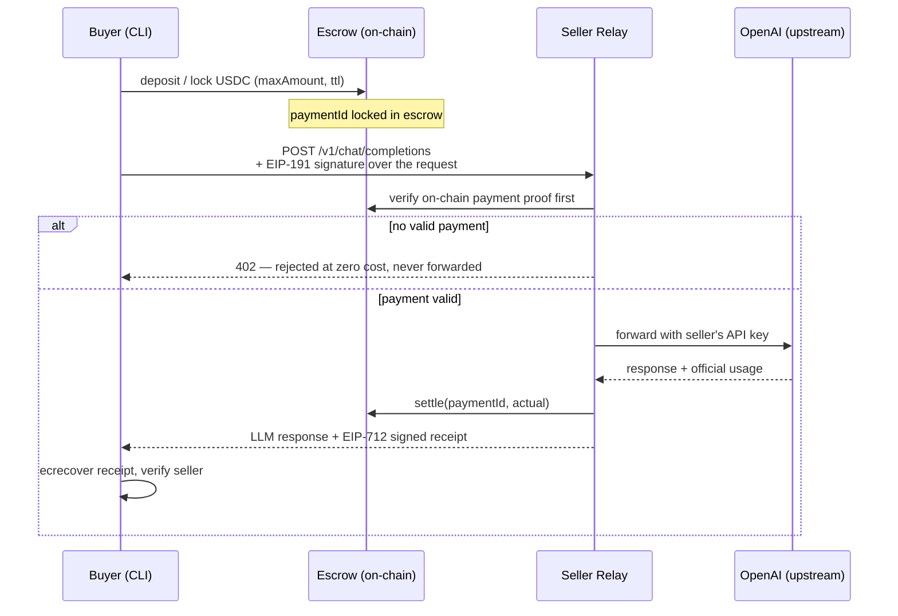

# TokenShare

**A pay-per-call marketplace for idle LLM API quota.** Sellers run a relay on their own API keys and rent out spare quota by the call; buyers pay a few cents of USDC per request, with an on-chain escrow contract holding and settling the funds. No custody, no upgrade keys, no trusted third party.

> Built for the **Monad Metropolis hackathon** — Track: **Trust, Identity & AI Infrastructure**.
> TokenShare supplies *trust-minimized wholesale API supply* for x402 / agentic payment rails: sellers put idle quota back to work, buyers get per-call pricing far below retail plans.

---

## How it works



In five steps:

1. **Deposit & lock** — the buyer deposits USDC into the `Escrow` contract and locks an amount against a seller (`paymentId`, max amount, TTL).
2. **Sign** — the CLI signs each request with **EIP-191** (method, path, body hash, paymentId) and attaches `X-Payment-Id` + `X-Signature`.
3. **Verify, then forward** — the seller relay checks the on-chain payment proof **before** forwarding anything to OpenAI. Unpaid requests get a **402 with zero upstream cost** — the seller's API key is never used for free.
4. **Pay for what you use** — settlement is priced in three tiers from the **official usage** returned by OpenAI: cached input / input / output tokens, each priced per 1M tokens in USDC (6-decimal native units).
5. **Settle & verify** — the relay calls `settle(paymentId, actual)` on-chain (difference vs. the lock is refunded to the buyer) and stamps the response with an **EIP-712 signed receipt**, which the CLI verifies via `ecrecover` against the seller's on-chain Registry address.

## Trust model

- **No key custody** — seller API keys live only in the seller's relay environment. They are never written to contracts, receipts, or any remote service. The protocol never touches anything but the escrowed payment funds.
- **No proxy, no upgrades** — the contracts are immutable once deployed. What you read is what you get.
- **Verify-then-forward** — the relay is economically required to check on-chain payment before spending its own upstream quota; unpaid traffic costs the seller nothing.
- **Chain-agnostic** — contracts contain zero chain-specific hardcoding (USDC address, chainId all injected via config). The exact same bytecode runs on Base Sepolia and Monad testnet.
- **Signed receipts** — every settlement comes with an EIP-712 receipt the buyer can independently verify, so a misbehaving relay is detectable.

## Architecture

| Module | What it is |
|--------|-----------|
| [`contracts/`](contracts/) | Foundry: `Escrow.sol` (deposit / lock / settle / refund / withdraw state machine) and `Registry.sol` (seller listings with three-tier pricing) |
| [`relay/`](relay/) | Seller relay — OpenAI-compatible FastAPI server (`POST /v1/chat/completions`, streaming supported) that verifies payments, forwards requests, prices usage, settles, and signs receipts |
| [`cli/`](cli/) | Buyer CLI — `deposit` / `lock` / `call` / `balance` / `refund` / `disputes`, with signature, receipt verification, and dispute ledger |
| [`web/`](web/) | Zero-framework static market page (listings, three-tier prices, escrow state) |
| [`e2e/`](e2e/) | End-to-end runner (`e2e/run.py --network base_sepolia\|monad_testnet`) + mock OpenAI |

**Stack:** Foundry (Solidity ^0.8.24, OpenZeppelin) · Python 3.11+ · FastAPI · Typer · web3.py · plain HTML/CSS/JS (no build step).

## Networks

| Network | Purpose | Chain ID | USDC |
|---------|---------|----------|------|
| Base Sepolia | development / CI — **optional** (Monad is the primary hackathon chain) | 84532 | `0x036CbD53842c5426634e7929541eC2318f3dCF7e` |
| Monad testnet | **hackathon deliverable** | 10143 | `0x534b2f3A21130d7a60830c2Df862319e593943A3` |

- **Faucets:** `https://faucet.monad.xyz` (MON) · `https://faucet.circle.com` (USDC for both chains)
- **Explorer:** `https://testnet.monadscan.com`

Both networks run the **same deployed bytecode** — only configuration (RPC, chain ID, USDC address) changes.

## Quickstart

**Requirements:** Python 3.11+ · [Foundry](https://book.getfoundry.sh) (`forge` / `anvil`) · a public Base Sepolia RPC for the local fork run (the default `https://sepolia.base.org` works).

```bash
# 1. Install Python dependencies (relay + CLI)
pip install -r relay/requirements.txt -r cli/requirements.txt

# 2. Build & test contracts (54 tests green)
cd contracts && forge test && cd ..

# 3. Relay + CLI unit tests
cd relay && pytest tests && cd ..     # relay suite
cd cli && pytest tests && cd ..       # 38+ tests green

# 4. Configure (keys/addresses — never commit .env)
cp .env.example .env

# 5. Full end-to-end run on a local Base-Sepolia anvil fork — no funds,
#    no API key needed (a deterministic mock OpenAI is started automatically):
python3 e2e/run.py --network base_sepolia
```

Expected tail of a successful run:

```
OK: payment 2 Settled, actual=11400 native (0.011400 USDC) <= maxAmount 5000000
OK: payment 1 Refunded (M4 refund path verified on-chain)

E2E PASSED
```

The runner drives the whole stack itself: it starts an anvil fork of Base Sepolia, deploys `Escrow` + `Registry` (+ a `MockUSDC` stand-in) via `forge script script/Deploy.s.sol`, writes `contracts/deployed.json`, mints test USDC, registers a seller listing that points at a locally started mock OpenAI and the relay, then drives the **real buyer CLI** through `deposit → lock → call → settle → refund` as a black-box subprocess and asserts the settled receipt plus the on-chain state (`Escrow` payment Settled, escrow balances moved buyer→seller, refund path credited back).

For a paid call against a **real OpenAI key** instead of the mock: set `OPENAI_API_KEY` and `OPENAI_BASE_URL=https://api.openai.com` in `.env` and start the relay yourself (`uvicorn relay.app.main:app --port 8787`, run from the repo root with `.env` exported).

### Manual step-by-step (what `run.py` automates)

With `.env` filled (see `.env.example` for every variable) and contracts deployed:

```bash
# 1) Deploy (writes contracts/deployed.json — relay/CLI read it for the addresses):
cd contracts
USDC_ADDR=0x036CbD53842c5426634e7929541eC2318f3dCF7e \
  forge script script/Deploy.s.sol --sig run(string) base_sepolia \
  --rpc-url https://sepolia.base.org --broadcast \
  --private-key $PRIVATE_KEY --sender $DEPLOYER_ADDR     # unset USDC_ADDR → MockUSDC
cd ..

# 2) Seller registers a listing (direct web3; the relay endpoint goes on-chain):
python3 e2e/register_listing.py --network base_sepolia \
  --endpoint http://127.0.0.1:8787 \
  --price-cached-in 1000 --price-input 2000 --price-output 3000   # per-1M-token USDC native

# 3) Seller starts the relay (uses RELAY_SELLER_KEY + the 12 relay env names, see .env.example):
python3 -m uvicorn relay.app.main:app --host 127.0.0.1 --port 8787   # from repo root

# 4) Buyer (from cli/ with .env exported):
cd cli
python3 -m tokenshare_cli deposit --amount 500
python3 -m tokenshare_cli call "Explain EIP-712 in one sentence" --seller $SELLER_ADDR --max 5
python3 -m tokenshare_cli balance
cd ..
```

`deployed.json` holds `{network, chainId, escrow, registry, usdc, usdcIsMock, deployer, deployedAt}`; copy those addresses into `.env` (`ESCROW_ADDR` / `REGISTRY_ADDR` / `USDC_ADDR`).

⚠️ Lock sizing: every lock/call `--max` (maxAmount) must be **≥ the relay's per-request minimum estimate** `(priceInput×PROMPT_TOKEN_CAP + priceOutput×COMPLETION_TOKEN_CAP)/1e6` (USDC native), otherwise the relay rejects with **HTTP 402** — on a 402, either raise `--max` or lower the caps env on both relay and CLI.

### Monad testnet (real chain — M5b)

Same code path, configuration-only switch. Prerequisites (executed in M5b, with user-provided funded test accounts):

1. Fund two test accounts: `https://faucet.monad.xyz` (MON gas) + `https://faucet.circle.com` (USDC), put `SELLER_PRIVATE_KEY` / `BUYER_PRIVATE_KEY` in `.env`.
2. Deploy once (official Circle USDC, no mock):

   ```bash
   cd contracts
   USDC_ADDR=0x534b2f3A21130d7a60830c2Df862319e593943A3 \
     forge script script/Deploy.s.sol --sig run(string) monad_testnet \
     --rpc-url https://testnet-rpc.monad.xyz --broadcast --private-key <SELLER key>
   cd ..
   ```

3. Run the same e2e against the real chain (reads `contracts/deployed.json` + env keys):

   ```bash
   python3 e2e/run.py --network monad_testnet
   ```

4. For buyer-facing demos the relay must be reachable over the internet: expose it (e.g. a tunnel), then `export RELAY_PUBLIC_ENDPOINT=https://…` before the run so the Registry listing carries the public URL. Transactions are viewable at `https://testnet.monadscan.com`.

## Repo layout

```
tokenshare/
├── contracts/               # Foundry: Escrow + Registry, 54 tests green
│   ├── src/Escrow.sol
│   ├── src/Registry.sol
│   └── script/Deploy.s.sol  # --sig run(string), writes deployed.json
├── relay/                   # FastAPI seller relay
│   ├── app/                 # main / pricing / receipt / chain / config
│   └── tests/
├── cli/                     # Typer buyer CLI
│   ├── tokenshare_cli/      # signing / receipt / streaming / disputes / ...
│   └── tests/               # 38 tests green
├── web/                     # static market page (zero framework)
├── e2e/                     # run.py --network base_sepolia|monad_testnet + mock_openai.py
└── TokenShare-BUILD_SPEC.md # build spec
```

## Demo

<!-- M6 -->
Live demo: Vercel deployment link — *coming soon*. Screenshots of the live market page and Monad testnet transactions will be added here.

---

## Status

Hackathon **prototype** — not audited, not production-ready, handles **no real funds** (testnet USDC only).
