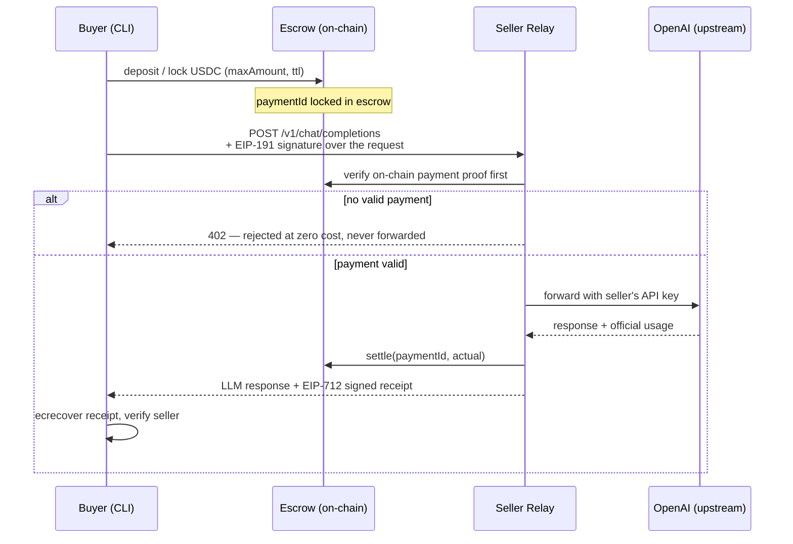

# TokenShare

**Renting out idle quota of OFFICIAL LLM subscription plans.** Sellers expose the spare quota of their official plan (OpenAI, Kimi/Moonshot, …) through a relay that forwards **only to the provider's official endpoint**; buyers pay a few cents of USDC per request, with an on-chain escrow contract holding and settling the funds. No custody, no upgrade keys, no trusted third party.

> Built for the **Monad Metropolis hackathon** — Track: **Trust, Identity & AI Infrastructure**.
> TokenShare supplies *trust-minimized wholesale API supply* for x402 / agentic payment rails: sellers put idle quota back to work, buyers get per-call pricing far below retail plans.

---

## How it works



In five steps:

1. **Deposit & lock** — the buyer deposits USDC into the `Escrow` contract and locks an amount against a seller (`paymentId`, max amount, TTL).
2. **Sign** — the CLI signs each request with **EIP-191** (method, path, body hash, paymentId) and attaches `X-Payment-Id` + `X-Signature`.
3. **Verify, then forward** — the seller relay checks the on-chain payment proof **before** forwarding anything to OpenAI. Unpaid requests get a **402 with zero upstream cost** — the seller's API key is never used for free.
4. **Pay for what you use** — settlement is priced in three tiers from the **official usage** returned by OpenAI: cached input / input / output tokens, each priced per 1M tokens in USDC (6-decimal native units).
5. **Settle & verify** — the relay calls `settle(paymentId, actual)` on-chain (difference vs. the lock is refunded to the buyer) and stamps the response with an **EIP-712 signed receipt**, which the CLI verifies via `ecrecover` against the seller's on-chain Registry address.

## Trust model

- **No key custody** — seller API keys live only in the seller's relay environment. They are never written to contracts, receipts, or any remote service. The protocol never touches anything but the escrowed payment funds.
- **No proxy, no upgrades** — the contracts are immutable once deployed. What you read is what you get.
- **Verify-then-forward** — the relay is economically required to check on-chain payment before spending its own upstream quota; unpaid traffic costs the seller nothing.
- **Chain-agnostic** — contracts contain zero chain-specific hardcoding (USDC address, chainId all injected via config). The exact same bytecode runs on Base Sepolia and Monad testnet.
- **Signed receipts** — every settlement comes with an EIP-712 receipt the buyer can independently verify, so a misbehaving relay is detectable.

## Official-endpoint-only upstreams

TokenShare rents out **official-plan** quota, so a served model must be an official-plan model hitting the provider's **official endpoint**. The relay enforces this at two layers:

1. **Startup host allowlist** — the relay refuses to start unless `OPENAI_BASE_URL`'s host is in `OFFICIAL_UPSTREAM_HOSTS` (relay/app/config.py). A custom upstream needs the explicit dev/test flag `ALLOW_CUSTOM_UPSTREAM=1`, which logs a WARNING that the authenticity guarantee is void.
2. **Per-request model/provider consistency** — the requested model's official-catalog prefix must match the upstream host's provider; unknown prefixes and mismatches are rejected with 400 and never forwarded.

| Official host | Provider | Model prefixes |
|---------------|----------|----------------|
| `api.openai.com` | openai | `gpt-`, `o1`, `o3`, `o4`, `chatgpt-` |
| `api.moonshot.cn` (Kimi domestic) | moonshot | `kimi-`, `moonshot-` |
| `api.moonshot.ai` (Kimi international) | moonshot | `kimi-`, `moonshot-` (keys are **not** interchangeable with `.cn`) |

**Seller pre-check (`GET /verify-upstream`)** — before registering (or re-registering) a listing, the seller can self-check that the configured key actually serves the models it wants to list: the relay calls the upstream's official `GET /v1/models` with its own key and cross-checks every `listing.models` entry — each model must be accessible with this key AND (official host) carry the matching provider prefix. Response body: `{key_valid, upstream_host, accessible_models, listing_ok, listed_models, mismatches, error?}` (HTTP stays 200; semantics live in the body; prices are never verified — pricing is the seller's freedom). `e2e/register_listing.py` runs this check automatically before spending register gas (`--skip-verify` / unreachable relay to bypass). On an official upstream the relay also probes `/v1/models` at startup (`VERIFY_UPSTREAM_ON_START=1` default, `0` to disable): a key rejected with 401/403 fails startup fast, transient network errors only log a WARNING.

**Why this prevents poisoning:** a seller cannot point the relay at a lookalike endpoint and serve fake models or fake usage — the host is pinned to the official set, the model must carry the matching provider's catalog prefix, and every EIP-712 receipt now records `upstreamHost` + `model` so a buyer can audit exactly which official host and which model served each settled call. The relay reference implementation is the client-side guarantee; the ultimate proof of serving integrity is the **M7 TEE attestation** (remote attestation of the serving environment), which this layer is designed to hand off to.

Custom upstreams (`http://127.0.0.1:…` mocks, proxies) are **development and test only** — the e2e runner sets `ALLOW_CUSTOM_UPSTREAM=1` for its mock automatically; a real-chain e2e run defaults to the official upstream from env (`OPENAI_BASE_URL` + `OPENAI_API_KEY`) and only uses the mock when `E2E_FORCE_MOCK_OPENAI=1` is set explicitly.

> Kimi note: request bodies must not carry `temperature` / `top_p` (Kimi rejects them with HTTP 400 for any value, including 0). The relay itself injects zero sampling parameters and forwards the buyer's body verbatim.

## Architecture

| Module | What it is |
|--------|-----------|
| [`contracts/`](contracts/) | Foundry: `Escrow.sol` (deposit / lock / settle / refund / withdraw state machine) and `Registry.sol` (seller listings with three-tier pricing) |
| [`relay/`](relay/) | Seller relay — OpenAI-compatible FastAPI server (`POST /v1/chat/completions`, streaming supported) that verifies payments, forwards requests, prices usage, settles, and signs receipts |
| [`cli/`](cli/) | Buyer CLI — `deposit` / `lock` / `call` / `balance` / `refund` / `disputes`, with signature, receipt verification, and dispute ledger |
| [`web/`](web/) | Zero-framework static market page (listings, three-tier prices, escrow state) |
| [`e2e/`](e2e/) | End-to-end runner (`e2e/run.py --network base_sepolia\|monad_testnet`) + mock OpenAI |

**Stack:** Foundry (Solidity ^0.8.24, OpenZeppelin) · Python 3.11+ · FastAPI · Typer · web3.py · plain HTML/CSS/JS (no build step).

## Networks

| Network | Purpose | Chain ID | USDC |
|---------|---------|----------|------|
| Base Sepolia | development / CI — **optional** (Monad is the primary hackathon chain) | 84532 | `0x036CbD53842c5426634e7929541eC2318f3dCF7e` |
| Monad testnet | **hackathon deliverable** | 10143 | `0x534b2f3A21130d7a60830c2Df862319e593943A3` |

- **Faucets:** `https://faucet.monad.xyz` (MON) · `https://faucet.circle.com` (USDC for both chains)
- **Explorer:** `https://testnet.monadscan.com`

Both networks run the **same deployed bytecode** — only configuration (RPC, chain ID, USDC address) changes.

## Quickstart

**Requirements:** Python 3.11+ · [Foundry](https://book.getfoundry.sh) (`forge` / `anvil`) · a public Base Sepolia RPC for the local fork run (the default `https://sepolia.base.org` works).

```bash
# 1. Install Python dependencies (relay + CLI)
pip install -r relay/requirements.txt -r cli/requirements.txt

# 2. Build & test contracts (54 tests green)
cd contracts && forge test && cd ..

# 3. Relay + CLI unit tests
cd relay && pytest tests && cd ..     # 81 tests green
cd cli && pytest tests && cd ..       # 56 tests green

# 4. Configure (keys/addresses — never commit .env)
cp .env.example .env

# 5. Full end-to-end run on a local Base-Sepolia anvil fork — no funds,
#    no API key needed (a deterministic mock OpenAI is started automatically):
python3 e2e/run.py --network base_sepolia
```

Expected tail of a successful run:

```
OK: payment 2 Settled, actual=11400 native (0.011400 USDC) <= maxAmount 5000000
OK: payment 1 Refunded (M4 refund path verified on-chain)

E2E PASSED
```

The runner drives the whole stack itself: it starts an anvil fork of Base Sepolia, deploys `Escrow` + `Registry` (+ a `MockUSDC` stand-in) via `forge script script/Deploy.s.sol`, writes `contracts/deployed.json`, mints test USDC, registers a seller listing that points at a locally started mock OpenAI and the relay, then drives the **real buyer CLI** through `deposit → lock → call → settle → refund` as a black-box subprocess and asserts the settled receipt plus the on-chain state (`Escrow` payment Settled, escrow balances moved buyer→seller, refund path credited back).

For a paid call against a **real official-platform key** instead of the mock: set `OPENAI_API_KEY` and `OPENAI_BASE_URL` (test default: `https://api.moonshot.cn`, Kimi — see `.env.example`) in `.env` and start the relay yourself (`uvicorn relay.app.main:app --port 8787`, run from the repo root with `.env` exported). The host must be in the official allowlist above.

### Manual step-by-step (what `run.py` automates)

With `.env` filled (see `.env.example` for every variable) and contracts deployed:

```bash
# 1) Deploy (writes contracts/deployed.json — relay/CLI read it for the addresses):
cd contracts
USDC_ADDR=0x036CbD53842c5426634e7929541eC2318f3dCF7e \
  forge script script/Deploy.s.sol --sig run(string) base_sepolia \
  --rpc-url https://sepolia.base.org --broadcast \
  --private-key $PRIVATE_KEY --sender $DEPLOYER_ADDR     # unset USDC_ADDR → MockUSDC
cd ..

# 2) Seller starts the relay (uses RELAY_SELLER_KEY + the 12 relay env names, see .env.example):
python3 -m uvicorn relay.app.main:app --host 127.0.0.1 --port 8787   # from repo root

# 3) Verify BEFORE registering — prove the key really serves the models you
#    plan to list (key_valid=true + your models under accessible_models):
curl -s http://127.0.0.1:8787/verify-upstream | python3 -m json.tool
#    register_listing.py runs this same check automatically before sending
#    the register tx; skip it only with --skip-verify.

# 4) Seller registers a listing (direct web3; the relay endpoint goes on-chain).
#    --model must be an official-plan model matching the relay's upstream:
#    Kimi (api.moonshot.cn) → kimi-k2.6; OpenAI → gpt-4o-mini, etc.
python3 e2e/register_listing.py --network base_sepolia \
  --endpoint http://127.0.0.1:8787 \
  --model kimi-k2.6 \
  --price-cached-in 1000 --price-input 2000 --price-output 3000   # per-1M-token USDC native

# 5) Buyer (from cli/ with .env exported); --model defaults to the first model
#    of the Registry listing (here kimi-k2.6):
cd cli
python3 -m tokenshare_cli deposit --amount 500
python3 -m tokenshare_cli call "Explain EIP-712 in one sentence" --seller $SELLER_ADDR --max 5
python3 -m tokenshare_cli balance
cd ..
```

`deployed.json` holds `{network, chainId, escrow, registry, usdc, usdcIsMock, deployer, deployedAt}`; copy those addresses into `.env` (`ESCROW_ADDR` / `REGISTRY_ADDR` / `USDC_ADDR`).

⚠️ Lock sizing: every lock/call `--max` (maxAmount) must be **≥ the relay's per-request minimum estimate** `(priceInput×PROMPT_TOKEN_CAP + priceOutput×COMPLETION_TOKEN_CAP)/1e6` (USDC native), otherwise the relay rejects with **HTTP 402** — on a 402, either raise `--max` or lower the caps env on both relay and CLI.

### Monad testnet (real chain — M5b)

Same code path, configuration-only switch. Prerequisites (executed in M5b, with user-provided funded test accounts):

1. Fund two test accounts: `https://faucet.monad.xyz` (MON gas) + `https://faucet.circle.com` (USDC), put `SELLER_PRIVATE_KEY` / `BUYER_PRIVATE_KEY` in `.env`.
2. Deploy once (official Circle USDC, no mock):

   ```bash
   cd contracts
   USDC_ADDR=0x534b2f3A21130d7a60830c2Df862319e593943A3 \
     forge script script/Deploy.s.sol --sig run(string) monad_testnet \
     --rpc-url https://testnet-rpc.monad.xyz --broadcast --private-key <SELLER key>
   cd ..
   ```

3. Run the same e2e against the real chain (reads `contracts/deployed.json` + env keys):

   ```bash
   python3 e2e/run.py --network monad_testnet
   ```

4. For buyer-facing demos the relay must be reachable over the internet: expose it (e.g. a tunnel), then `export RELAY_PUBLIC_ENDPOINT=https://…` before the run so the Registry listing carries the public URL. Transactions are viewable at `https://testnet.monadscan.com`.

## Repo layout

```
tokenshare/
├── contracts/               # Foundry: Escrow + Registry, 54 tests green
│   ├── src/Escrow.sol
│   ├── src/Registry.sol
│   └── script/Deploy.s.sol  # --sig run(string), writes deployed.json
├── relay/                   # FastAPI seller relay
│   ├── app/                 # main / pricing / receipt / chain / config
│   └── tests/
├── cli/                     # Typer buyer CLI
│   ├── tokenshare_cli/      # signing / receipt / streaming / disputes / ...
│   └── tests/               # 56 tests green
├── web/                     # static market page (zero framework)
├── e2e/                     # run.py --network base_sepolia|monad_testnet + mock_openai.py
└── TokenShare-BUILD_SPEC.md # build spec
```

## Demo

<!-- M6 -->
Live demo: Vercel deployment link — *coming soon*. Screenshots of the live market page and Monad testnet transactions will be added here.

### Web frontend (`web/`)

Zero-framework static pages — market (live Registry listings + relay health) and a Seller/Buyer console (register, deposit, lock, signed call, receipt verify, refund).

- **Local:** `python3 -m http.server 8080 -d web` → open http://localhost:8080 (console at `/console.html`). Any free port works.
- **Deploy:** point Vercel at the `web/` directory — no build step, zero runtime external references (ethers is vendored).
- **Config:** `web/config.js` is the only chain-facts surface — fill `escrowAddr` / `registryAddr` / `sellers` from `contracts/deployed.monad.json` after a redeploy.
- **Demo:** MetaMask required for the console; the page guides adding Monad testnet (chainId 10143) via `wallet_addEthereumChain`.

---

## Status

Hackathon **prototype** — not audited, not production-ready, handles **no real funds** (testnet USDC only).
